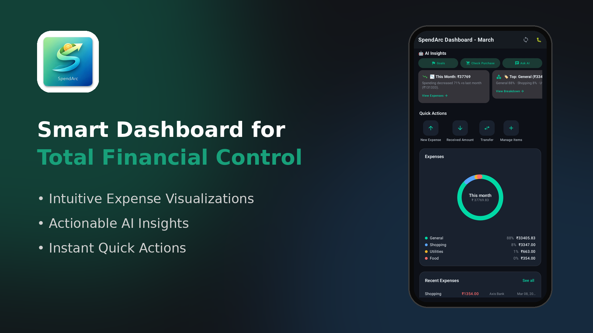
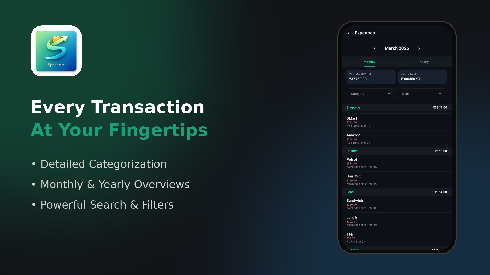
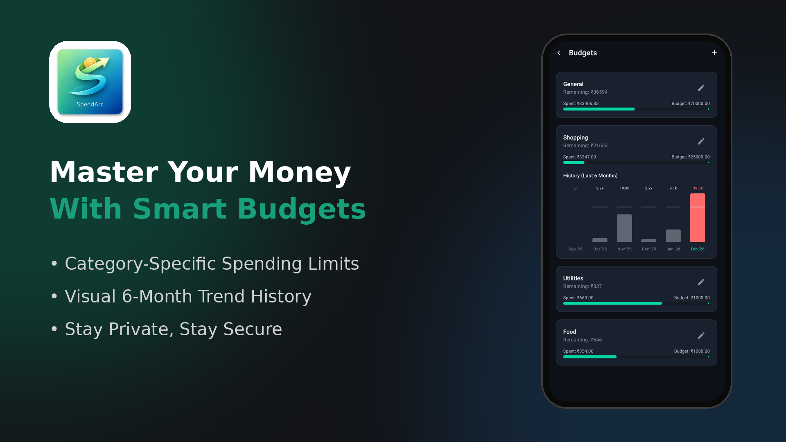
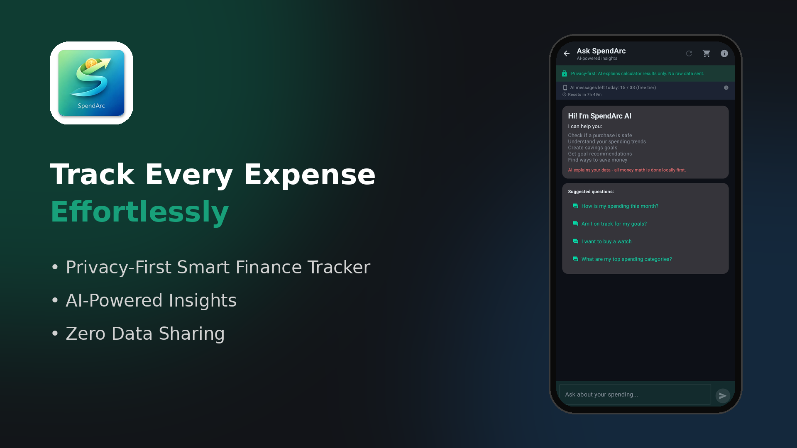
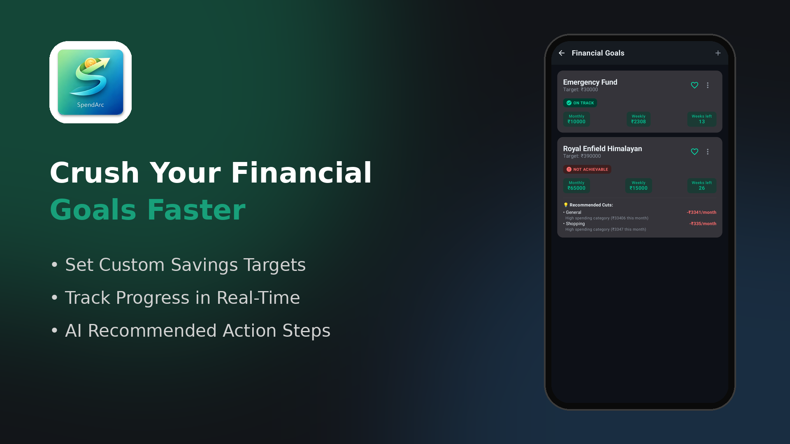

  <h1 align="center">💰 SpendArc</h1>
  
<strong>Your money, your device, your control.</strong>

  
A privacy-first personal finance tracker for Android.

  
<em>This is the <strong>SpendArc‑Public</strong> repository — a product overview and showcase.</em>

---

## What is SpendArc?

SpendArc is a personal finance app that helps you **track spending, plan budgets, set savings goals, and get AI-powered insights** — all without your financial data ever leaving your device.

It can automatically read your bank and UPI SMS messages (with your permission) to record transactions, so you spend less time entering data and more time understanding where your money goes.

---

## Who is it for?

- 🧑‍💼 Individuals who want a clear picture of their finances
- 🔒 Privacy-conscious users who don't want financial data in the cloud
- 📱 Android users looking for a fast, offline-first expense tracker
- 🎯 Anyone setting savings goals or managing monthly budgets

---

## What can you do with SpendArc?

- **Track expenses and income** — automatically from SMS or by manual entry
- **See where your money goes** — visual breakdowns by category
- **Set budgets** — per-category monthly budgets with progress tracking
- **Plan savings goals** — set targets with timelines and priority levels
- **Ask the AI assistant** — get spending insights, check if a purchase is safe, and plan goals through natural conversation
- **Manage multiple accounts** — banks, cash, and wallets in one place
- **Stay private** — all data stays on your device; no cloud sync, no data selling

---

## 📸 Screenshots

  
  &nbsp;&nbsp;
  
  &nbsp;&nbsp;
  

  
  &nbsp;&nbsp;
  

| Screen | What you see |
|:------:|:-------------|
| **Dashboard** | Monthly spending summary, category breakdown, recent transactions, and quick actions |
| **Expenses** | Detailed expense list with category and account filters |
| **Budgets** | Per-category budget progress with monthly history |
| **AI Chat** | Natural-language assistant for spending insights and goal planning |
| **Goals** | Savings goals with progress tracking and status indicators |

---

## Platform

SpendArc is an Android app built with modern tools and a privacy-first architecture.

---

## Links

- 🌐 Website: *Coming soon*
- 📲 Google Play: *Coming soon*
- 📧 Contact: See [CONTACT.md](CONTACT.md)

---

## More Information

| Document | Description |
|----------|-------------|
| [FEATURES.md](FEATURES.md) | Full list of user-facing features |
| [PRIVACY.md](PRIVACY.md) | How SpendArc handles your data |
| [ROADMAP.md](ROADMAP.md) | What's being explored for the future |
| [FAQ.md](FAQ.md) | Frequently asked questions |
| [CHANGELOG.md](CHANGELOG.md) | High-level version history |
| [CONTACT.md](CONTACT.md) | How to reach us |
| [LICENSE](LICENSE) | License for SpendArc‑Public content |

---

## ⚠️ Important Notice

> **SpendArc‑Public does not contain source code.**
>
> SpendArc‑Public exists solely as a public product overview and showcase for SpendArc.
> You cannot build, compile, or run the app from anything in SpendArc‑Public.
> The application source code is not publicly available.

---

Made with ❤️ for people who care about their money <em>and</em> their privacy.

